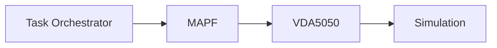

# ROS Industrial Demo

ROS Industrial Demo is an end-to-end warehouse automation reference implementation that demonstrates how TaskOrchestrator, MAPF ( multi-agent path finder ), Vda5050 and Simulation can operate together within a single interoperable platform.

The project provides a modular architecture for coordinating autonomous mobile robots (AMRs) in industrial and warehouse environments using open standards and reusable services.

## Core Modules



| Module | Description |
|----------|-------------|
| Task Orchestrator | A workflow engine built on top of Crossflow's reactive event framework. It coordinates business workflows, executes tasks, and dispatches work to downstream systems. |
| MAPF | A Multi-Agent Path Finding service responsible for generating conflict-free routes and coordinating traffic for multiple robots operating in the same environment. |
| VDA5050 | An implementation of the VDA5050 v2.0 interoperability standard, providing a vendor-neutral interface between fleet management systems and autonomous mobile robots. |
| Simulation | A Unreal Engine 5 (UE5) simulation environment that implements VDA5050 and device interfaces, allowing workflows and robot integrations to be developed and validated in a virtual environment before deployment. |

## Quick Start

### Prerequisites

Install required packages
```bash
sudo apt install python3-pip python3-venv
pip3 install pika redis requests pymongo psutil
```

Create the shared Docker network:
```bash
docker network create rmf2_broker_rmf-network
```

### Setup
#### Core RMF Modules
Create a workspace and clone the required repositories:

```bash
mkdir -p ~/ros_industrial_ws
cd ~/ros_industrial_ws

# Clone repositories (legacy branch)
git clone -b legacy <demo-package-url> ros_industrial_demo
git clone -b legacy <vda5050-fiware-url> vda5050_fiware_repo
git clone -b legacy <mapf-unified-url> mapf_unified_repo
git clone -b legacy <task-orchestrator-url> task_orchestrator_repo
git clone -b legacy <rmf2-broker-url> rmf2_broker_repo
```

Build the required Docker images:

```bash
# VDA5050 FIWARE Bridge
cd ~/ros_industrial_ws/vda5050_fiware_repo
docker build -t vda5050_fiware_repo-vda5050_fiware:latest .

# MAPF Unified (includes map server, solver, executor)
cd ~/ros_industrial_ws/mapf_unified_repo
docker build -t mapf_unified:latest .

# Task Orchestrator
cd ~/ros_industrial_ws/task_orchestrator_repo/
docker build -t task_orchestrator:latest .

# IOCS Broker Stack (Scorpio, Redis, RabbitMQ, Postgres)
cd ~/ros_industrial_ws/rmf2_broker_repo
docker  build -f ./Containers/rmf-base.Dockerfile . -t mctdis/rmf-base
docker compose build
```

### Warehouse Simulation Setup

Download the latest simulation

```sh
curl -OL https://downloads.rmf-industrial.org/UE5Demos/RMF2_SIM_20260606.zip
```

Unzip the simulation

```sh
unzip RMF2_SIM_20260606.zip
mv RMF2_SIM_20260606 ~/ros_industrial_ws/simulation
```

Start the simulation
```sh
cd ~/ros_industrial_ws/simulation
./Linux/RMF2_SIM.sh
```

#### Controls

The simulation starts in fullscreen mode by default. Press Alt + Enter to toggle fullscreen.

- Move: `W A S D`
- Toggle Fullscreen: `Alt + Enter`
- Map Marker: `M`

---

## Running the Environment

### Quick Start (No Simulation, Unified MAPF)

Start all services:

```sh
cd ~/ros_industrial_ws/ros_industrial_demo/launch
./start_environment_tmux.sh
```

Stop all services:

```sh
./stop_environment_tmux.sh
```