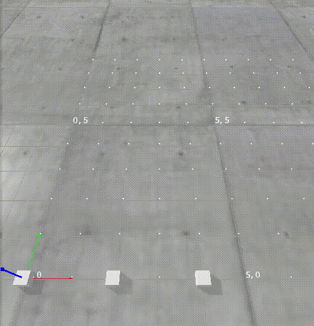

# Coordination and Execution of a Multi-Agent Path Finding (MAPF) plan

## Introduction
This repository implements coordination and execution of an MAPF plan.  
An MAPF plan from a prior planner is converted into an Action Dependency Graph (ADG).  
From the ADG, actions are executed according to their dependencies.

It is based on the paper:

`W. Hönig, S. Kiesel, A. Tinka, J. W. Durham and N. Ayanian, "Persistent and Robust Execution of MAPF Schedules in Warehouses," in IEEE Robotics and Automation Letters, vol. 4, no. 2, pp. 1125-1131, April 2019, doi: 10.1109/LRA.2019.2894217.`

See [References](#references).

## Getting started

### Set up workspace

Download the mapf.repos file

```shell
export WORKSPACE="full_path_to_your_workspace"

mkdir -p $WORKSPACE/src
vcs import $WORKSPACE/src < mapf.repos

cd $WORKSPACE
python3 -m venv env
source env/bin/activate


cd src
for repo in mapf_execution mapf_pybullet movement_request_server
do
    cd "$repo"
    python3 -m pip install -r requirements.txt
    cd -
done
cd ..
```


## Usage

### Concept

1. Solve a classical MAPF problem with an MAPF solver. The solution should be a list of positions that agents should move to at each timestep.
2. The `ActionDependencyGraph` class generates an ADG from the `GlobalPlan`, creating the dependencies between agent moves.
3. Define a subclass that implements `ADGAgent` and defines how the action at each vertex is to be executed.
    * A `SharedMemoryAgent` [example](examples/agent_shmd.py) is provided which communicates the commands and completion status by writing to a [SharedMemoryDict](https://github.com/luizalabs/shared-memory-dict)
4. Use the [Executor](adg/executor.py) to function to queue vertices of the ADG for execution.

### Run the local demonstration with PyBullet



The demonstration comprises a PyBullet simulation that communicates with the ADG execution over a SharedMemoryDict to move robots.

In the first terminal:
```shell
export WORKSPACE="full_path_to_your_workspace"
cd $WORKSPACE
source env/bin/activate
cd src/mapf_execution
python3 -m examples.example_01_4_robots.main
```

In the second terminal:
```shell
export WORKSPACE="full_path_to_your_workspace"
cd $WORKSPACE/src/mapf_execution
source $WORKSPACE/env/bin/activate
export PYTHONPATH="${PYTHONPATH}:$WORKSPACE/src/mapf_pybullet";
python3 -m mapf_pybullet.simulation.simulation examples/example_01_4_robots/4_robots.yaml --show-labels
```
Press the Escape key to exit the simulation.

See [examples](examples) for more.

## References

The [cbs](centralized/cbs) directory is from [multi_agent_path_planning](https://github.com/atb033/multi_agent_path_planning).

The construction of the Action Dependency Graph in `adg.py` also referenced the repository's [implementation](https://github.com/atb033/multi_agent_path_planning/tree/master/centralized/scheduling) of [Multi-Agent Path Finding with Kinematic Constraints](https://www.aaai.org/ocs/index.php/ICAPS/ICAPS16/paper/view/13183/12711).
