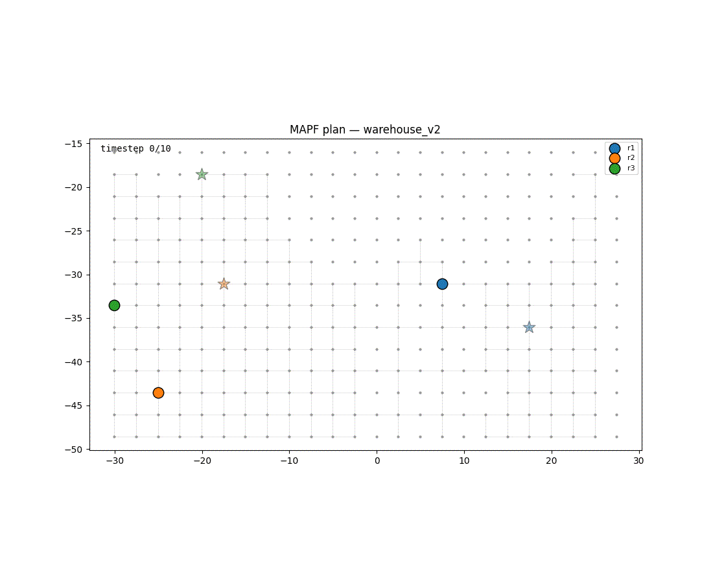
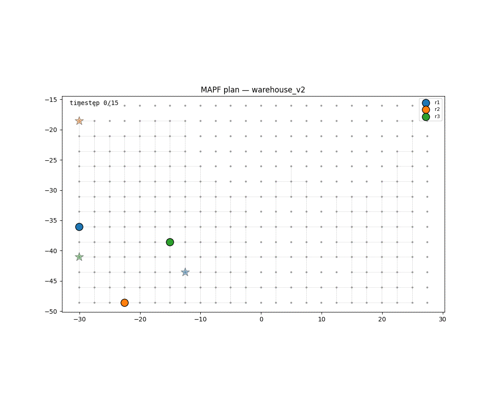
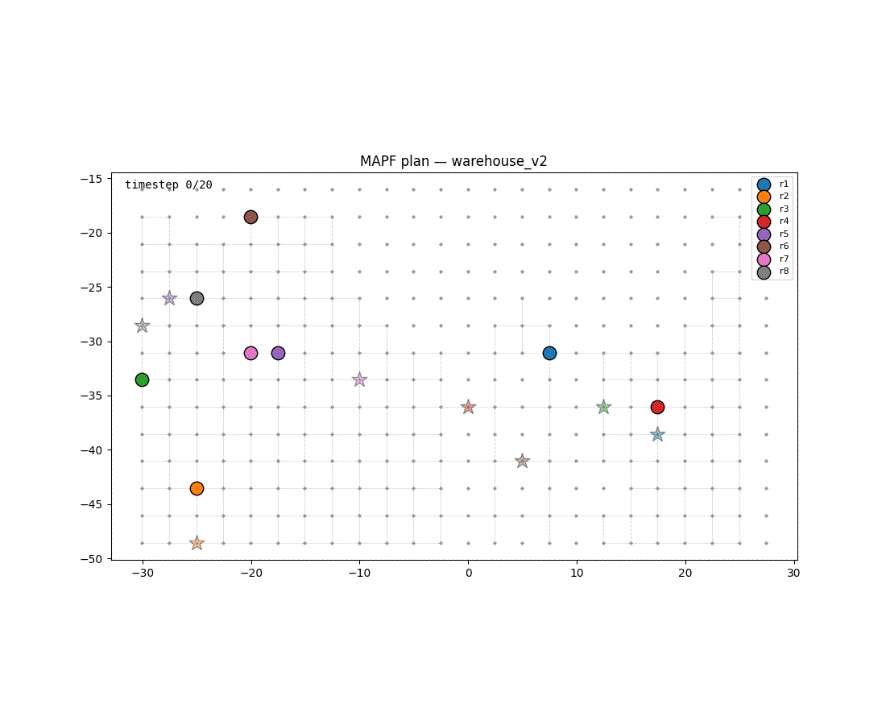
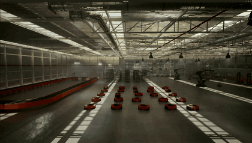

# MAPF test scripts

Tests for the MAPF stack in `mapf_unified_repo`, plus a visualizer and a set of
live robot-driving scripts. The Python test is built only against the repo's
HTTP contract; the bash scripts drive a running demo by sending replace-destination
commands to live robots.

| Script | Target | Needs running |
| --- | --- | --- |
| `mapf_solver_test.py` | Solver directly (`:8888`) — plan **+ visualization** | just the `mapf_unified` container |
| `loop_tasks.sh` + helpers | Live robots via `test_replace_destination.py` | full stack **+ robots/UE5 sim** |

## Install

```bash
cd <path/to/workspace>/ros_industrial_demo/test_scripts/mapf
pip install -r requirements.txt        # requests, pyyaml, matplotlib, pillow
```

---

## 1. MAPF Solver Test + Visualization 

This test sends a multi-agent path finding (MAPF) problem straight to the solver,
independently verifies that the returned plan is collision-free. It is the quickest way to *see* MAPF working, and the only thing it needs running is the solver itself.

### Start-up guide

The solver test needs just two things up: **Redis** (which also creates the shared
docker network) and the **`mapf_unified`** solver container itself. Bring them up in
this order — the network has to exist before the solver starts. All paths below are
relative to this directory (`ros_industrial_demo/test_scripts/mapf`).

**1. Start Redis + create the shared network**

```bash
cd <path/to/workspace>/<rmf2_broker_repo>
docker compose -p rmf2_broker up -d redis
```

The project name `rmf2_broker` is what makes the network come up as
`rmf2_broker_rmf-network` — the exact external network that `mapf_unified`'s
`compose.yml` expects (`networks: rmf2_broker_rmf-network: external: true`).
Starting Redis any other way names the network differently and the solver hangs
waiting for it.

**2. Build & start the solver**

```bash
cd <path/to/workspace>/<mapf_unified_repo>
docker compose up -d --build        # first build ~10–15 min; omit --build on later runs
```

This starts the `mapf_unified` container, which exposes the solver on `:8888`.

**3. Wait until the solver answers**

```bash
# The solver only answers POST — a GET just hangs. A 400 (empty body rejected) means
# it is up and parsing requests; connection-refused keeps the loop waiting.
until curl -s -o /dev/null --max-time 3 -X POST http://localhost:8888/; do sleep 2; done && echo "solver up"
```

> Only need to confirm something is already running? Jump to
> [Troubleshooting Guide](#troubleshooting-guide) at the bottom.

#### Run a test

Install the Python dependencies once (see [Install](#install) above), then run
whichever test you want:

```bash
cd <path/to/workspace>/ros_industrial_demo/test_scripts/mapf
```

### Running the standalone test

```bash
# default: 3 random agents on the warehouse_v2 map
./mapf_solver_test.py
```
Sample Output: 



```bash

# pick your own agents (AGENT:START:GOAL), any number
./mapf_solver_test.py --task r1:P5:P100 --task r2:P42:P12 --task r3:P88:P3
```

Sample Output: 

```bash

# more agents / different solver
./mapf_solver_test.py --random 8 --solver CBS
```

Sample Output: 



```bash
# Custom map
./mapf_solver_test.py --map </path/to/map.yaml> --random 5
```


## MAPF Solver test flags

| Flag | Default | Description |
|---|---|---|
| `--map` | warehouse_v2.yaml | RMF map YAML file |
| `--host` | `localhost` | Solver host |
| `--port` | `8888` | Solver port |
| `--solver` | `ECBS` | Solver to use (`ECBS`, `CBS`, `ICBS`, `PIBT`, `PIBT_COMPLETE`, `HCA`, `WHCA`, `IR`) |
| `--max-comp-ms` | `25000` | Maximum computation time in milliseconds |
| `--max-timestep` | `1000` | Maximum timestep for the plan |
| `--task` | `[]` | Explicit task in `AGENT:START:GOAL` form; repeatable; overrides `--random` |
| `--random` | `3` | Generate N random agents |
| `--seed` | `42` | Random seed |
| `--out` | `out` directory next to script | Output directory |
| `--fps` | `12` | Frames per second for visualization |
| `--no-viz` | `false` | Skip PNG/GIF rendering |

> For the full help text, run `./mapf_solver_test.py --help`.

### Reading the log output

Each stage prints one bracket-tagged line. A successful run looks like:

```text
[map]    .../mapf_unified_repo/.../maps/warehouse_v2.yaml
[map]    336 nodes, 385 lanes, 226 navigable
[tasks]  r1:P217->P270, r2:P30->P28, r3:P6->P243, ...
[solver] POST http://localhost:8888/  (CBS)
[plan]   8 agents, makespan=20
           r1: 7 moves  P217 -> P270
           r3: 20 moves  P6 -> P243
[PASS]   plan is collision-free (no vertex or edge/swap conflicts)
[viz]    out/mapf_plan.png
[viz]    out/mapf_plan.gif
[done]
```

| Tag | Meaning |
|---|---|
| `[map]` | The map YAML being loaded, then its size: total **nodes**, **lanes** (directed edges), and how many nodes are **navigable** (lie on at least one lane). Non-navigable nodes are obstacles and cannot be used as a start or goal. |
| `[tasks]` | The agent assignments being solved, shown as `AGENT:START->GOAL`. Comes from your `--task` flags, or from `--random N`. |
| `[warn]` | A start/goal node is not on any lane (an obstacle). The solver will most likely reject the request with `400 Bad Request` — pick a navigable node instead. |
| `[solver]` | The HTTP `POST` sent to the solver, with the chosen algorithm in parentheses (`--solver`). |
| `[plan]` | The solver returned a plan: the agent count and **`makespan`** (number of timesteps until the last agent reaches its goal). The indented lines below list each agent's **move count** and `START -> GOAL`. `moves` counts only timesteps where the agent changes node — waits are not counted — so it is usually less than the makespan. |
| `[PASS]` / `[FAIL]` | The actual test verdict (details below). `[FAIL]` prints the first 10 conflicts and exits non-zero. |
| `[viz]` | Paths to the rendered `mapf_plan.png` (static) and `mapf_plan.gif` (animated) under `--out`. Shows `skipped` instead if matplotlib/pillow aren't installed. |
| `[done]` | The run completed. |

---

## 2. Driving robots in a loop (live demo scripts)

A set of bash scripts that send **replace-destination** commands to robots that are
already running, then watch them via the ADG executor logs.  **They need the full stack + robots (UE5 sim or real AGVs)
running.**

> **Robot ids and node names must match the active map** (`BUILDING_NAME` in
> `mapf_unified_repo/.env`). These scripts assume `warehouse_os_setup`/`warehouse_v2`
> with robots `Manufacturer_2..25`.

### Setup — bring up the full stack first

Bring the whole demo up first with the tmux launcher,
which starts each service in its own pane and health-gates each step before moving to
the next:

```bash
cd <path/to/workspace>/ros_industrial_demo/launch
./start_environment_tmux.sh
```

It brings up, in order:
- **broker / IOCS** (`:8000`), 
- **MQTT**, 
- **MAPF unified**(`:8888`), 
- **Task Orchestrator** (`:2727`), 
- **VDA5050 devices**
- **Simulation**,

and finally run an initilzation script which places the
robots on the map. 

Everything runs inside a tmux session named `RMF2_Demo`, which the
script attaches to when it finishes; on a failed health gate it dumps the offending
pane and leaves the session running so you can inspect it.

Useful flags:

- `./start_environment_tmux.sh --status` — show ports / containers / tmux status without starting anything.
- `./start_environment_tmux.sh --step N` — re-run from step N onward (debugging a single service).
- `tmux attach -t RMF2_Demo` — attach to the running session (also where a failed gate leaves you).

Once the robots are initialized on `warehouse_v2` (verify with `--status`), the loop
scripts below have something to drive.

| Script | What it does |
| --- | --- |
| `loop_tasks.sh N [loops]` | Sends robots out to their task positions, waits until they arrive, sends them home, waits, and repeats. |
| `send_test_tasks.sh [N] [--dry-run]` | Fire-and-forget: send the first `N` robots (default 24, any `1–24`) each to a fixed task destination once. `--dry-run` prints the commands without sending. |
| `send_all_home_warehouse_v2.sh` | Send all 24 robots back to their home positions (matches the init layout in `launch/send_init_warehouse_v2.sh`). |
| `check_robot_orders.sh [N]` | Read-only verification: prints where each robot actually is (VDA5050 final node + ADG executor position) vs. its expected goal. |

### `loop_tasks.sh`

```bash
./loop_tasks.sh 24            # 24-robot task set, loop forever
./loop_tasks.sh 6 5          # 6-robot task set, run 5 loops then stop
./loop_tasks.sh 24 --dry-run # show the planned task/home moves, send nothing
```

Demo (`./loop_tasks.sh 24 1` in the UE5 sim, sped up ~3.6×): the 24 robots fan out to
their task positions and then drive back home — one full loop.



It derives the two sets of destinations automatically:

- **Home positions** are parsed from `launch/send_init_warehouse_v2.sh` (the
  `goal_location` for each `Manufacturer_N`).
- **Task positions** come from `send_test_tasks.sh N --dry-run` (the first `N` robots
  of the shared destination table).

Each loop runs two phases — **Phase 1** to the task positions, **Phase 2** back home —
and between phases it polls `docker logs vda5050_fiware` until every robot's last order
shows it has arrived.

`loops` defaults to `0` (infinite).

> The task-set argument is just `N` (any `1–24`); both `loop_tasks.sh` and
> `check_robot_orders.sh` derive their robot→goal mapping from `send_test_tasks.sh`,
> so the four destinations live in exactly one place.

### Checking results

```bash
./check_robot_orders.sh        # just dump each robot's last order + ADG position
./check_robot_orders.sh 24     # also verify against the 24-robot task set's goals
```

With a task-set argument it prints an `Expected | VDA5050 | ADG Pos | Match | Status`
table and a pass/fail summary. A robot counts as matched if **either** its VDA5050
final node **or** its ADG executor position equals the expected goal. It reads
`docker logs vda5050_fiware` and the `adg_executor_err.log` inside the `mapf_unified`
container, so those must be up; it never commands a robot.

---

## Troubleshooting Guide
### Standalone Testing (MAPF Solver)

```bash
docker logs mapf_unified --tail 30 -f                                   # live logs
```

If `:8888` doesn't respond, the solver isn't up — follow the
[Start-up guide](#start-up-guide) above to bring up Redis (which creates the shared
network) and then the solver. The short version, run from this directory:

```bash
cd <path/to/workspace>/rmf2_broker_repo && docker compose -p rmf2_broker up -d redis   # network + Redis
cd <path/to/workspace>/mapf_unified_repo      && docker compose up -d                        # solver on :8888
```

For more on the solver container itself, see
[`mapf_unified_repo/README.md`](../../../mapf_unified_repo/README.md).

## How this maps to the code (mapf_unified_repo)

- Solver request/response: `src/mapf/mapf_service/.../include/mapf/mapf.hpp`
  (and the reference client `src/mapf_execution/mapf_solve/mapf_solve_request.py`).
- `send_task` / `monitor_task` shapes: `movement_request_server/app/{main,models}.py`.
- Map format parsed here (vertices + lanes): the same YAML the solver loads, e.g.
  `src/mapf/mapf_service/mapf_service/maps/warehouse_v2.yaml`.
